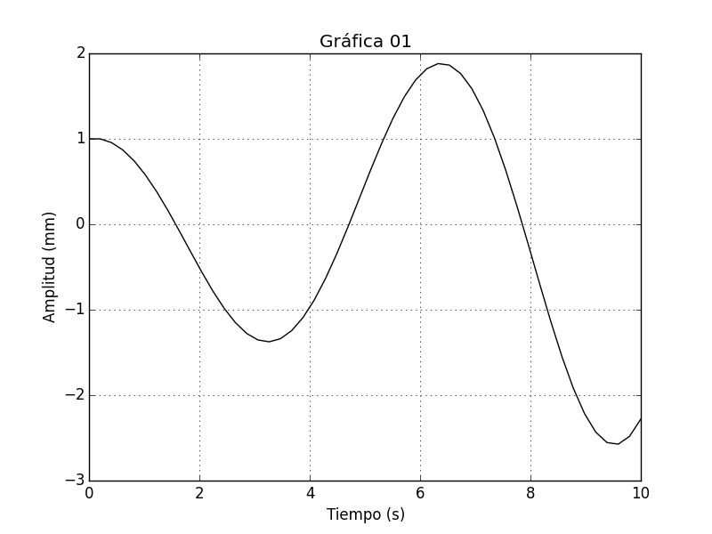

# Una introducción a Pylab

Pylab es un módulo de Matplotlib que, básicamente, integra en un mismo espacio de nombres utilidades gráficas 
del módulo pyplot y las numéricas de NumPy, resultando un entorno que se asemeja a MATLAB en el manejo 
de matrices/vectores y el trazo de gráficas.

Para importar todas las funciones de pylab podemos hacerlo como sigue:

```python
from pylab import *
```

Con esto tendremos disponible todas las funciones y/o constantes en el espacio de trabajo actual.

## Matrices y vectores

Algo básico que podemos hacer con Pylab es crear con vectores y matrices de una forma rápida:

```python
>>> v=array([-2,0,1,5,3]) #Definiendo un vector
>>> v
array([-2,  0,  1,  5,  3])
>>> A=array([[1,-1,-5],[8,2,10],[-5,2,3]]) # Definiendo una matriz
>>> A
array([[ 1, -1, -5],
       [ 8,  2, 10],
       [-5,  2,  3]])
```

Realizar operaciones matriciales básicas:

```python
>>> B=array([[1,5,0],[7,-9,2],[1,1,3]])
>>> # Suma de matrices
>>> A+B
array([[ 2,  4, -5],
       [15, -7, 12],
       [-4,  3,  6]])
>>> # Resta de matrices
>>> A-B
array([[ 0, -6, -5],
       [ 1, 11,  8],
       [-6,  1,  0]])
>>> # Multiplicación matricial
>>> dot(A,B)
array([[-11,   9, -17],
       [ 32,  32,  34],
       [ 12, -40,  13]])
```

Note que la multiplicación matricial se debe realizar con la función `dot`, si se efectua la multiplicación con 
el operador `*`, este dará el resultado de una multiplicación elemento por elemento.

También se pueden utilizar algunas funciones típicas de un paquete de álgebra lineal para operar sobre matrices:

```python
>>> det(A) # Determinante de A
-69.999999999999957
>>> inv(A) # Matriz inversa de A
array([[  2.00000000e-01,   1.00000000e-01,   2.77555756e-17],
       [  1.05714286e+00,   3.14285714e-01,   7.14285714e-01],
       [ -3.71428571e-01,  -4.28571429e-02,  -1.42857143e-01]])
>>> transpose(A) # Transpuesta de A
array([[ 1,  8, -5],
       [-1,  2,  2],
       [-5, 10,  3]])
```

## Gráficas

Otra utilidad de pylab son las gráficas, es tan sencillo como utilizar la función `plot`:

```python
plot([1,3,-2,0,1])
show()
```

<!--  -->

Si se requiere algo más elaborado:

```python
x = linspace(0,10)
y = exp(0.1*x)*cos(x)

plot(x,y,'k')
xlabel("Tiempo (s)")
ylabel("Amplitud (mm)")
title(u"Gráfica 01")
grid(True)

show()
```

AAAA
<!--  -->

O múltiples gráficas:

```python
x = linspace(0,10)
y1 = exp(0.1*x)*cos(x)
y2 = exp(0.5*x)*sin(x)

subplot(2,1,1)
plot(x,y1,'r')
ylabel("Amplitud (mm)")
grid(True)

subplot(2,1,2)
plot(x,y2,'b')
xlabel("Tiempo (s)")
ylabel("Amplitud (mm)")
grid(True)
```

ABC